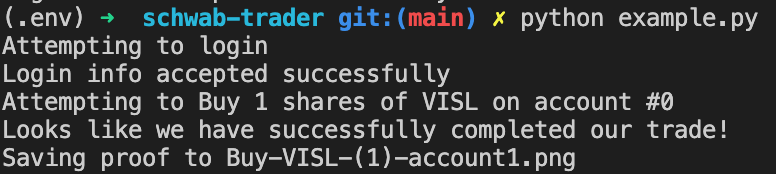

# Schwab API

**This is not an official API or even a stable recreation of a Charles Schwab API. Functionality may change with any updates made by Schwab. As of December 2023, this API continues to work as expected.**

This package enables buying and selling securities programmatically on Charles Schwab. Currently, we use a headless browser to automate logging in in order to get authorization cookies. All other functionality is done through web requests made to Schwab's own API.

## Features

* Buying and Selling tickers
* Get quotes for multiple tickers
* Get order information
* Account and Position Information
* Limit / Stop orders are possible using trade_v2 parameters
* Multiple individual account support
* MFA and TOTP authentication
* Web Request implementation (with the exception of authentication)

## Live Demo

I am currently using this package to place trades on Schwab using my website [here](https://itsjafer.com/#/reversesplit).



## Contribution

I would absolutely love contributions; as someone new to open source, I'd appreciate help in setting up a reliable system for PRs as well :)

## Getting Started

### Installing

Install using pypi and then download and install the playwright binaries:

```
pip install schwab-api
python -m playwright install
```

### Set up your account to use TOTP

In order to login to Schwab without having to go through SMS verification everytime, you'll need to create an authentication token (TOTP) and attach that to your Schwab account.


1. Download a TOTP app like Google Authenticator.
2. [Go to my website and generate a TOTP key there](https://itsjafer.com/#/schwab) by clicking 'Generate TOTP' and following the instructions. You should get a Symantec ID and a TOTP key/QR code.

Alternatively, you can do this programmatically:

```
from schwab_api import generate_totp

symantec_id, totp_secret = generate_totp()

print("Your symantec ID is: " + symantec_id)
print("Your TOTP secret is: " + totp_secret)
```

3. Open Google Authenticator and click the `+` button to add a new account
4. Either enter the TOTP key manually and scan the QR code from step 2.
5. Log in to the Schwab [security center](https://client.schwab.com/app/access/securitysettings/#/security/verification)
6. Under Two-Step Verification, select Always at Login, and then select "Security Token" as your method.
7. Enter the Symantec ID from step 2 into the Credential ID field.
8. Enter the 6-digit code from Google Authenticator into the Security Code field.
9. Done! Now keep your TOTP secret from step 2 handy as your `SCHWAB_TOTP_SECRET` in your `.env` file under the example directory.

### Quickstart

You can run this code in a [Colab Notebook here](https://github.com/itsjafer/schwab-api/blob/main/Schwab_API_Example.ipynb).

Here's some code that logs in, gets all account holdings, and makes a stock purchase:
```
from schwab_api import Schwab
import pprint

# Initialize our schwab instance
api = Schwab()

# Login using playwright
print("Logging into Schwab")
logged_in = api.login(
    username=username,
    password=password,
    totp_secret=totp_secret # Get this by generating TOTP at https://itsjafer.com/#/schwab
)

# Get information about a few tickers
quotes = api.quote_v2(["PFE", "AAPL"])
pprint.pprint(quotes)

# Get information about all accounts holdings
print("Getting account holdings information")
account_info = api.get_account_info()
pprint.pprint(account_info)

print("The following account numbers were found: " + str(account_info.keys()))

print("Placing a dry run trade for AAPL stock")
# Place a dry run trade for account 99999999
messages, success = api.trade_v2(
    ticker="AAPL", 
    side="Buy", #or Sell
    qty=1, 
    account_id=99999999, # Replace with your account number
    dry_run=True # If dry_run=True, we won't place the order, we'll just verify it.
)

print("The order verification was " + "successful" if success else "unsuccessful")
print("The order verification produced the following messages: ")
pprint.pprint(messages)
```

## TODO

* Currently, we use a headless browser to login to Schwab; in the future, we want to do this purely with requests.
* Documentation of functionality

## Development Guide

Want to extend functionality? Here's how to get started:

1. After forking, install dependencies:
```
pip install .
playwright install && playwright install-deps
```

2. Run the example script:
```
pip install . && python example/example.py
```

3. Iterate on existing code: 
* Authentication largely exists in `schwab_api/authentication.py` and is done using Playwright.
* Trading happens in `schwab_api/schwab.py` in two functions: `trade` and `trade_v2` which use the legacy and new API respectively. Neither of these APIs are documented and were largely just reverse engineering through sniffing network requests in the UI.

### Deployment

Bumping the version number in `setup.py` will automatically trigger a deployment that must be approved by itsjafer@.

